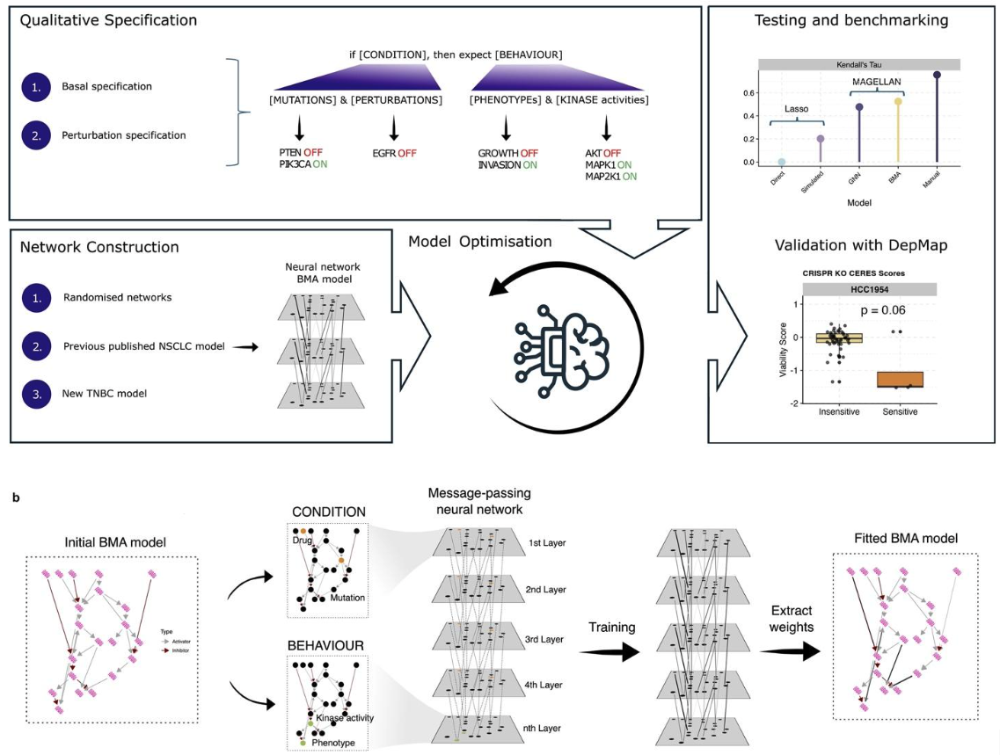

# MAGELLAN: Automated Generation of Interpretable Computational Models for Biological Reasoning 

Matthew A. Clarke*, Charlie George Barker*, Yuxin Sun*, Theodoros I. Roumeliotis, Jyoti S. Choudhary and Jasmin Fisher

(* indicates equal contribution)

This repository contains the code for the MAGELLAN project, which is a tool for automatically generating interpretable computational models for biological reasoning. For more details, please see the [paper](https://www.biorxiv.org/content/10.1101/2025.05.16.653408v1).


**MAGELLAN Overview:** MAGELLAN allows the generation of a computational model from pathway databases, and the fitting of these models to a user-specified specification, resulting in a transparent and interpretable model. This model can then be further edited and interrogated using the *BioModelAnalyzer* [GUI](https://biomodelanalyzer.org/) and [command line tools](https://biomodelanalyzer.org/).


## Installation

We use [`uv`](https://docs.astral.sh/uv/getting-started/installation/) to manage dependencies. To install the dependencies, run `uv venv` and `source .venv/bin/activate` to create a virtual environment, followed by `uv sync` to install the dependencies, and `uv pip install -e .` to install the package.

Run scripts with `uv run <script_name>.py`.

### Optional dependencies

To use optional pygraphviz functionality, please install the `graphviz` library (see [here](https://graphviz.org/download/)). For Linux: 

```bash
apt-get update
apt-get install -y graphviz graphviz-dev gcc clang
```

Then install the visualisation dependencies using `uv pip install -e .'[visualisation]'`.

## Usage

### Generating a network model from a pathway database

To generate a network model from a pathway database, run the `generate_network_model.py` script.

```bash
uv run scripts/gen_shortest_path_net.py --config scripts/example_configs/example_shortest_path_config.toml
```

This script takes as an input a csv file e.g. `example_data/shortest_path/gene_node_table.csv` which allows the user to specify genes to connect ('mutation', 'key' and 'driver', see Supplementary Methods). 

### Learning edge weights based on a specification. 

To learn edge weights based on a specification, run the `train_bio.py` script.

```bash
uv run scripts/train_bio.py --config scripts/example_configs/example_train_bio_config.toml
```

This script takes an existing BMA network as a JSON file, and a specification of experiments e.g. `example_data/spec/test_spec.csv`. 

### Simulate perturbations using BMA command line tools

To simulate perturbations using BMA command line tools, run the `run_BMA_simulation.py` script.

```bash
uv run scripts/run_BMA_simulation.py --config scripts/example_shortest_path_config.toml
```

This script takes as input a BMA network in JSON format, and a specification of experiments. This requires a local installation of BMA command line tools. BMA can most easily be [installed on Windows](https://biomodelanalyzer.org/). For other options, see [here](https://github.com/hallba/BioModelAnalyzer).

### Benchmarks

To run the benchmarks, run the `benchmarking_sweeps.py` script.

```bash
uv run scripts/benchmarking_sweeps.py --sweep-dir benchmarks/synthetic_benchmarks/configs --sweep example_sweep
```

This will run benchmarks specified for sweep configs in the sweep directory.


## Citation

Please cite the following paper when using MAGELLAN:

```bibtex
@article{clarke2025magellan,
	author = {Clarke, Matthew A. and Barker, Charlie George and Sun, Yuxin and Roumeliotis, Theodoros I. and Choudhary, Jyoti S. and Fisher, Jasmin},
	title = {MAGELLAN: Automated Generation of Interpretable Computational Models for Biological Reasoning},
	year = {2025},
	doi = {10.1101/2025.05.16.653408},
	publisher = {Cold Spring Harbor Laboratory},
	URL = {https://www.biorxiv.org/content/early/2025/05/19/2025.05.16.653408},
	journal = {bioRxiv}
}
```